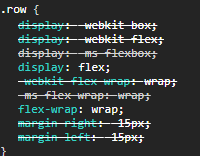
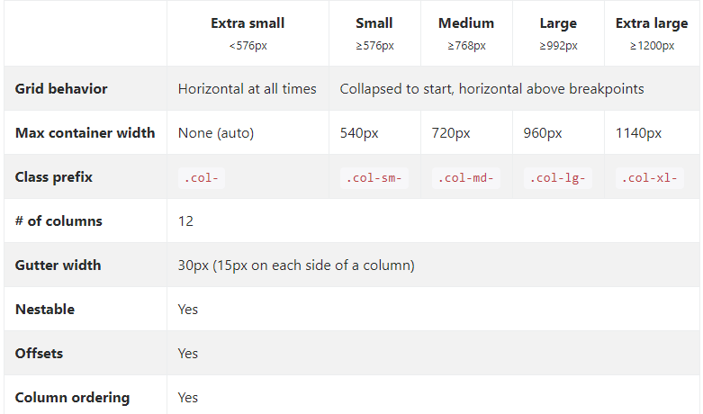
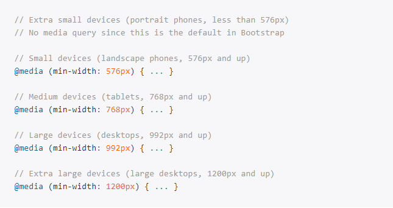

# Bootstrap

## A class row tem as propriedades

## O bootstrap utiliza grid e flexbox

### A class col tem as propriedades

**Note:** É possivel utilizar o flexbox com o sistema de grid. Colocando a porcentagem do grid no flex-basics

**Note:** Se faz o calculo do tamanho de cada grid, com porcentagem
Formúla (100% do grid/ número de colunas X coluna desejada) - tamanho do gutter = tamanho do grid em porcentagem

## Grid Options

[Grid Exemplo](https://getbootstrap.com/docs/4.6/examples/grid/#containers)

## Breakpoints

