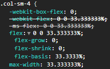
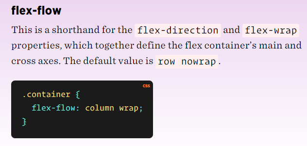
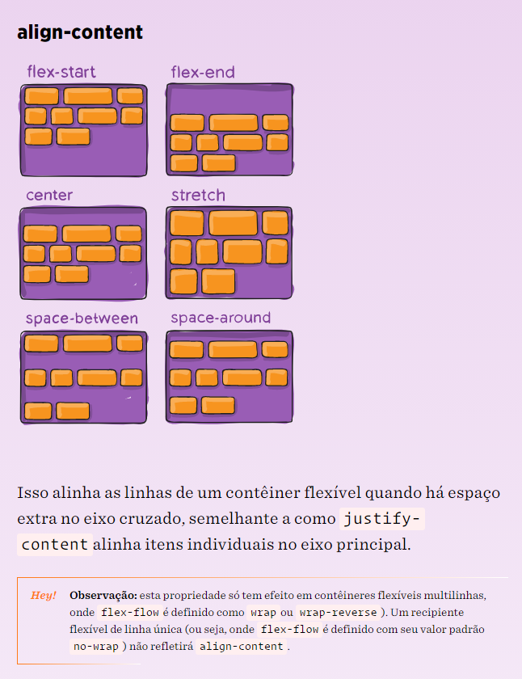
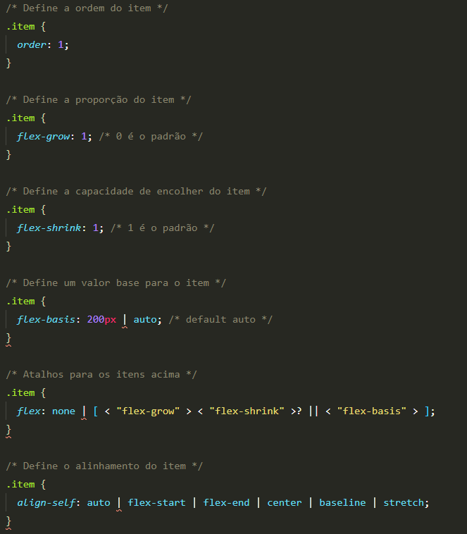
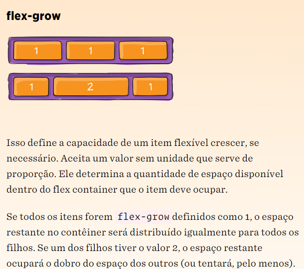
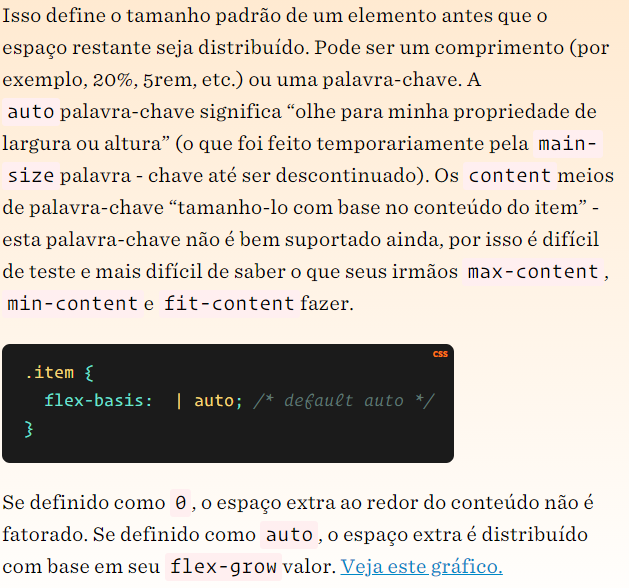
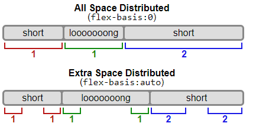
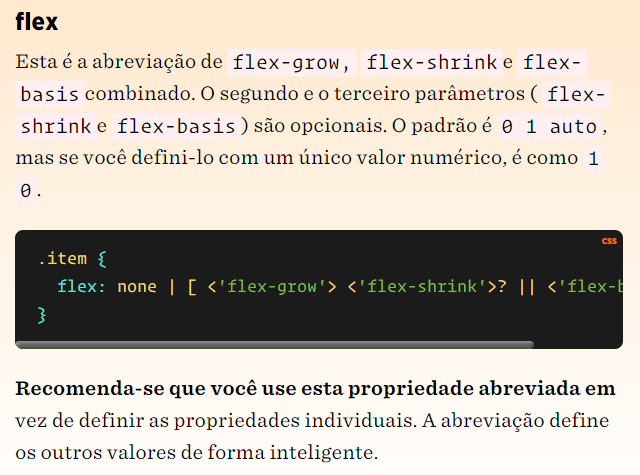

# Flexbox

**Note:** [Fonte](https://css-tricks.com/snippets/css/a-guide-to-flexbox/)

**Note:** img devem ser colocadas dentro de uma div, para não ocasionar bugs, como alargamento das imgs ou outros.

**Note:** É possivel utilizar o flexbox com o sistema de grid. Colocando a porcentagem do grid no flex-basics

- O flexbox foi criado para facilitar o posicionamento de componentes, principalmente quando você não sabe a largura e a altura do mesmo.

- Tudo começa com o display: flex; no elemento pai. A interação é baseada na relação entre o elemento pais e os filhos.

- Sendo o pai um container e os filhos items do container.

## Container

**_NOTE:_** Serve para resumir o flex direction e o flex wrap

## Items

- Se define a order dos items
- Obrigatorio definir a order de outros items
- o menor valor é o que vai ser o primeiro

- Use flex-basics para um melhor funcionamento

- flex

