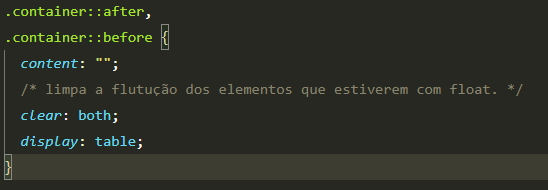
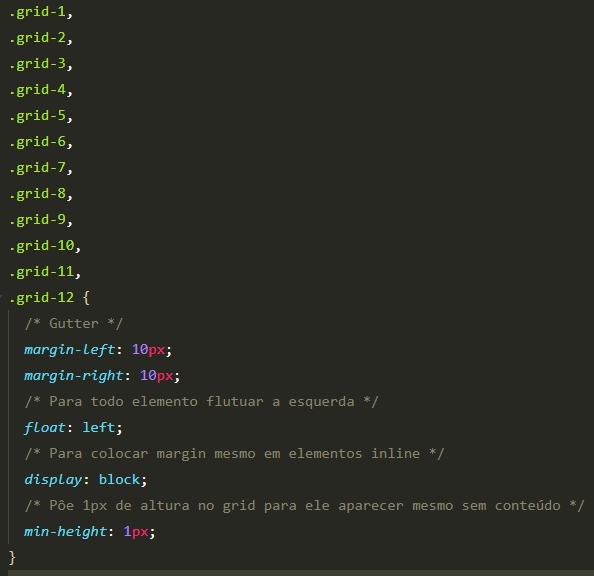
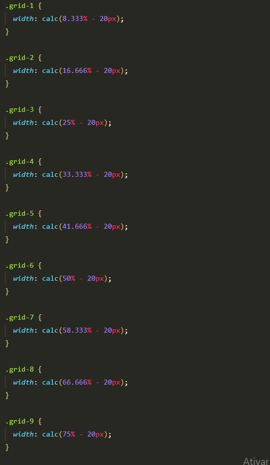
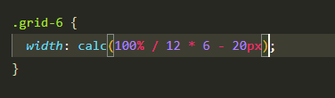
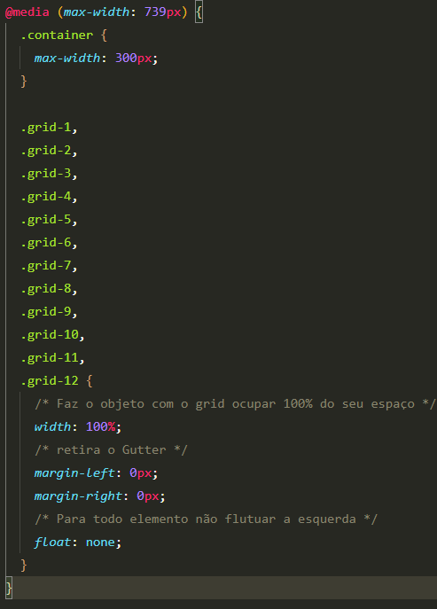

# Grid

## Passos para criação de um grid.

1. Primeiro se define o tamanho do container, que irá segurar o conteúdo, retirando o tamanho do gutter.

2. Depois se centraliza o container.

3. Depois se faz o clearfix do container. ClearFix impede que o elemento pai ignore a altura dos elementos filhos.

4. Nomeasse as classes para o grid, colocasse o gutter, a flutuação a esquerda e o display block para o gutter ter efeito em elementos inline.

5. Se faz o calculo do tamanho de cada grid, com porcentagem
   Formúla (100% do grid/ número de colunas X coluna desejada) - tamanho do gutter = tamanho do grid em porcentagem

obs: Pode-se usar a função calc para fazer a retirada do gutter ou outras contas.

6. Faz se o grid para mobile

